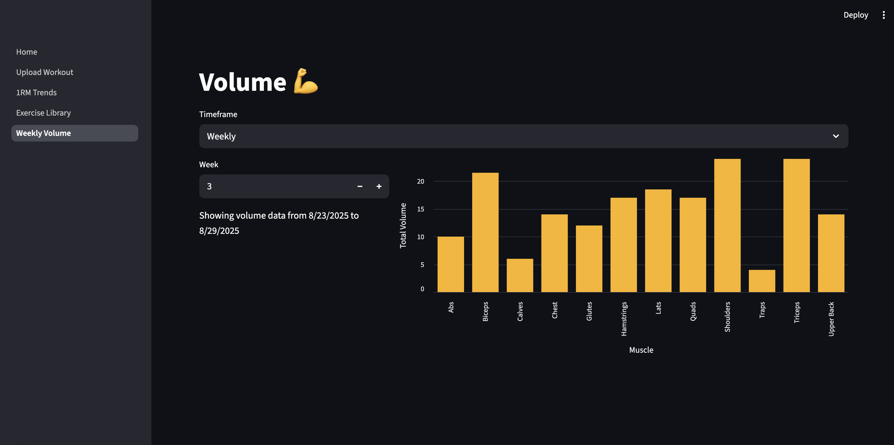

# Bianca's Data-Based Lifting Tracker

## About

Frustrated with Hevy, my workout tracking app, for its limited insights over time (including ones you have to pay for), I decided to create my own personal workout log. This page allows you to update the workout log while also viewing important trends like 1 rep maximum calculations and total weekly volume. 

The data is stored locally in a SQL database, which the Streamlit browser page connects with to show my workout progress and allows me to modify my log and other stored data. 

This is a work in progress, and I intend to add:

- a data_editor to the upload workout page to add an option besides the csv upload, to make it easier to upload data.
- convert the homepage to be more of a dashboard page with various insights at once
- a page to view my existing log as a table (more of a raw data rather than summary)
- a how-to page with definitions and explanations about calculations and why it's important to track certain things
- bodyweight and calorie tracking to better understand my maintenance calories and the nutrition side of my fitness
- and other features as I think of them!

Feel free to fork this if you're looking to better understand the science behind your lifts :)

## Instructions

To run this, simply navigate to your local repo on your computer and run "streamlit run Home.py" in your terminal. 

